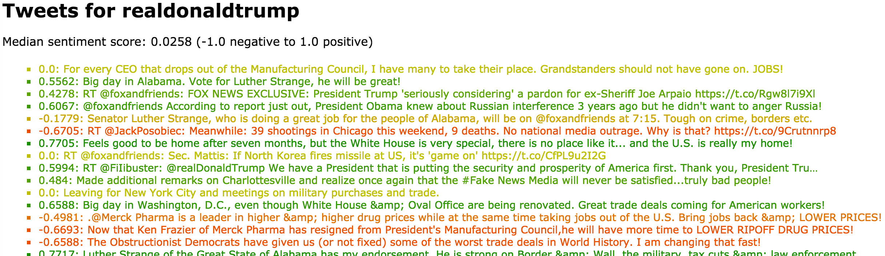

# Twitter Sentiment Analysis

In this project, I fetched Twitter data using Twitter API and tweepy, then performed sentiment analysis of each tweet using vaderSentiment library.

I aslo produced a web server running on AWS displaying given user's recent tweet list color-coded by sentiment. A web page was created to display the list of users followed by a given user.

--------------------
Following is an example of my final product:

